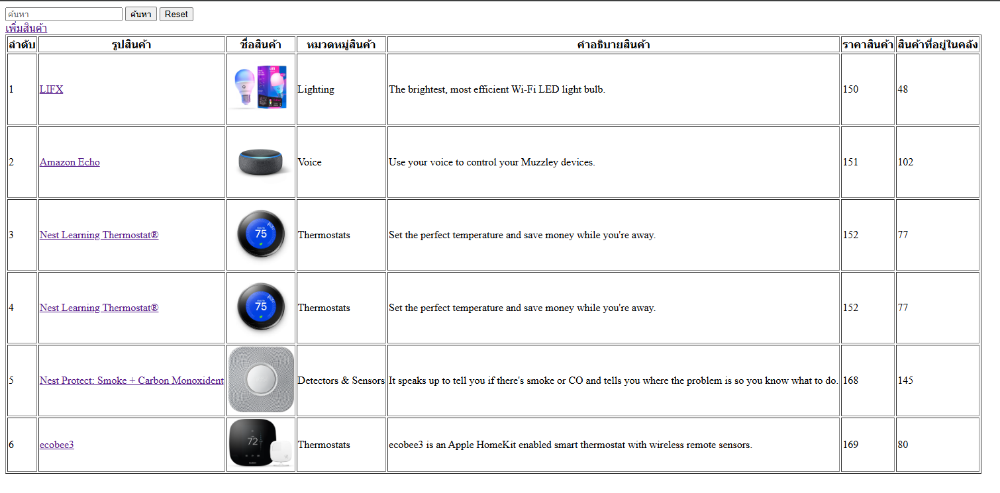
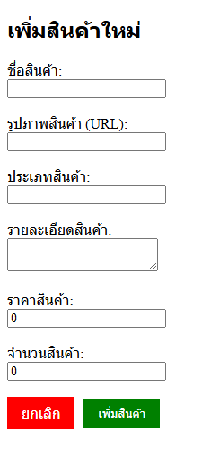
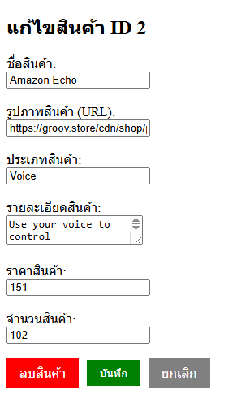

# PHP CRUD MySQL Application

แอปพลิเคชันจัดการสินค้าแบบ CRUD (Create, Read, Update, Delete) ที่พัฒนาด้วย PHP และ MySQL พร้อมฟังก์ชันค้นหาและตรวจสอบข้อมูล

## 📋 คุณสมบัติ

- ✅ **Create** - เพิ่มสินค้าใหม่พร้อมรูปภาพ
- ✅ **Read** - แสดงรายการสินค้าทั้งหมด
- ✅ **Update** - แก้ไขข้อมูลสินค้า
- ✅ **Delete** - ลบสินค้าที่ต้องการ
- 🔍 **Search** - ค้นหาสินค้าตามชื่อ หมวดหมู่ หรือรายละเอียด
- ✅ **Validation** - ตรวจสอบความถูกต้องของข้อมูลก่อนบันทึก

## 📦 ความต้องการของระบบ (Requirements)

- PHP 7.0 ขึ้นไป
- MySQL 5.7 ขึ้นไป หรือ MariaDB
- Web Server (Apache/Nginx) หรือใช้ XAMPP/Laragon

## 🚀 วิธีการติดตั้ง

### 1. ดาวน์โหลดโปรเจกต์

```bash
git clone [repository-url]
cd PHP-CRUD-MySQL-Application
```

# !!! ถ้าใช้ XAMPP หรือ Laragon ให้คัดลอกโฟลเดอร์โปรเจกต์ไปไว้ที่โฟลเดอร์ `htdocs` (XAMPP) หรือ `www` (Laragon)

### 2. สร้างฐานข้อมูล

เข้า phpMyAdmin แล้วสร้างฐานข้อมูลชื่อ `ShopDB`

หรือใช้คำสั่ง SQL:

```sql
CREATE DATABASE ShopDB CHARACTER SET utf8mb4 COLLATE utf8mb4_unicode_ci;
```

### 3. สร้างตาราง Products

เลือกฐานข้อมูล `ShopDB` แล้วรันคำสั่ง SQL ต่อไปนี้:

```sql
CREATE TABLE Products (
    PrdID INT AUTO_INCREMENT PRIMARY KEY,
    PrdName VARCHAR(50) NOT NULL,
    PrdPicture VARCHAR(100) NOT NULL,
    PrdCategory VARCHAR(50) NOT NULL,
    PrdDescription VARCHAR(250) NOT NULL,
    PrdPrice DECIMAL(10,2) NOT NULL,
    PrdQtyStock INT NOT NULL
) ENGINE=InnoDB DEFAULT CHARSET=utf8mb4;
```

### 4. กำหนดค่าการเชื่อมต่อฐานข้อมูล

แก้ไขไฟล์ [`dbConfig.php`](dbConfig.php) ตามข้อมูลการเชื่อมต่อฐานข้อมูลของคุณ:

```php
define('DB_HOST', 'localhost');      // ชื่อโฮสต์
define('DB_USERNAME', 'root');       // ชื่อผู้ใช้ฐานข้อมูล
define('DB_PASSWORD', '');           // รหัสผ่านฐานข้อมูล
define('DB_NAME', 'ShopDB');         // ชื่อฐานข้อมูล
```

### 5. เข้าใช้งาน

เปิดเบราว์เซอร์แล้วไปที่:

```
http://localhost/PHP-CRUD-MySQL-Application/
```

## 📂 โครงสร้างไฟล์

```
PHP-CRUD-MySQL-Application/
├── index.php              # หน้าแสดงรายการสินค้าพร้อมฟังก์ชันค้นหา
├── add_product.php        # หน้าเพิ่มสินค้าใหม่
├── edit_product.php       # หน้าแก้ไขข้อมูลสินค้า
├── delete_product.php     # หน้าลบสินค้า
├── dbConfig.php           # ไฟล์เชื่อมต่อฐานข้อมูล
├── style.css              # ไฟล์ CSS สำหรับตกแต่งหน้าเว็บ
└── README.md              # ไฟล์อธิบายโปรเจกต์
```
## 🎫 IMPORT SQL File
หากต้องการนำเข้าข้อมูลตัวอย่างทั้งหมดในครั้งเดียว ให้ใช้ไฟล์ `shopdb.sql` ที่แนบมาในโปรเจกต์นี้ โดยทำตามขั้นตอนดังนี้:
1. เปิด phpMyAdmin
2. เลือกฐานข้อมูล `ShopDB`
3. ไปที่แท็บ "นำเข้า" (Import)
4. เลือกไฟล์ `shopdb.sql` จากเครื่องของคุณ
5. คลิก "ไป" (Go) เพื่อทำการนำเข้า

## 💾 ตัวอย่างข้อมูล (Sample Data)

ใช้คำสั่ง SQL ต่อไปนี้เพื่อเพิ่มข้อมูลตัวอย่าง:

```sql
INSERT INTO Products (PrdName, PrdPicture, PrdCategory, PrdDescription, PrdPrice, PrdQtyStock) VALUES
('iPhone 15 Pro', 'https://store.storeimages.cdn-apple.com/4982/as-images.apple.com/is/iphone-15-pro-finish-select-202309-6-1inch_GEO_US?wid=5120&hei=2880&fmt=p-jpg&qlt=80&.v=1692845367643', 'Smartphone', 'สมาร์ทโฟนจาก Apple จอภาพ 6.1 นิ้ว ชิป A17 Pro', 39900, 50),
('MacBook Air M3', 'https://store.storeimages.cdn-apple.com/4982/as-images.apple.com/is/mba13-midnight-select-202402?wid=904&hei=840&fmt=jpeg&qlt=90&.v=1708570485614', 'Laptop', 'MacBook Air หน้าจอ 13.6 นิ้ว ชิป M3', 44900, 30),
('AirPods Pro', 'https://store.storeimages.cdn-apple.com/4982/as-images.apple.com/is/MQD83?wid=1144&hei=1144&fmt=jpeg&qlt=90&.v=1660803972366', 'Audio', 'หูฟังไร้สายพร้อมเทคโนโลยี Noise Cancellation', 7900, 100),
('iPad Air', 'https://store.storeimages.cdn-apple.com/4982/as-images.apple.com/is/ipad-air-finish-select-202210-pink-finish-select-202210?wid=5120&hei=2880&fmt=p-jpg&qlt=80&.v=1664414090337', 'Tablet', 'เท็บเล็ตหน้าจอ 10.9 นิ้ว ชิป M1', 21900, 45),
('Apple Watch Series 9', 'https://store.storeimages.cdn-apple.com/4982/as-images.apple.com/is/MT2D3ref_VW_34FR+watch-49-titanium-2up_VW_34FR_WF_CO?wid=2000&hei=2000&fmt=p-jpg&qlt=95&.v=1693815573689', 'Smartwatch', 'สมาร์ทวอทช์พร้อมฟังก์ชันสุขภาพ', 15900, 60),
('Samsung Galaxy S24', 'https://images.samsung.com/is/image/samsung/p6pim/th/2401/gallery/th-galaxy-s24-s928-sm-s928bzaeth-thumb-539573597', 'Smartphone', 'สมาร์ทโฟนจาก Samsung จอภาพ 6.8 นิ้ว', 34900, 40),
('Sony WH-1000XM5', 'https://electronics.sony.com/image/resource/prod/60/45/fc814311-a297-4958-8789-8729465c5c86.png?w=720', 'Audio', 'หูฟังไร้สายพร้อม Noise Cancellation ระดับพรีเมียม', 12900, 25),
('Dell XPS 15', 'https://i.dell.com/is/image/DellMarketing/content/dam/ss2/product-images/dell-client-products/notebooks/xps-notebooks/xps-15-9530/media-gallery/xs9550t-cnb-00000ff090-gy.psd', 'Laptop', 'แล็ปท็อปสำหรับงานกราฟิก หน้าจอ 15.6 นิ้ว', 69900, 20),
('Canon EOS R6', 'https://www.canon.co.uk/media/image/2020/07/08/3c7317b7905c497db265c90d066e876e_Canon-EOS-R6-MKII-front.png', 'Camera', 'กล้อง DSLR จอภาพ 20MP สำหรับงานถ่ายภาพมืออาชีพ', 89900, 15),
('Nintendo Switch OLED', 'https://media.nintendo.com/nintendo/switch/switch-oled-model/assets/images/benefits/hero_img01.jpg', 'Gaming', 'เครื่องเล่นเกมพกพา หน้าจอ OLED 7 นิ้ว', 14900, 80);
```

## 📖 คำอธิบายการทำงาน

### หน้าแรก ([`index.php`](index.php))
- แสดงรายการสินค้าทั้งหมดในตาราง
- มีช่องค้นหาสำหรับกรองสินค้าตามชื่อ, หมวดหมู่, หรือรายละเอียด
- กดชื่อสินค้าเพื่อไปหน้าแก้ไข
- ปุ่มเพิ่มสินค้าใหม่
- ใช้ Prepared Statement ป้องกัน SQL Injection

### หน้าเพิ่มสินค้า ([`add_product.php`](add_product.php))
- ฟอร์มกรอกข้อมูลสินค้าใหม่
- ตรวจสอบความถูกต้องของข้อมูล:
  - ชื่อสินค้า: ต้องไม่เกิน 50 ตัวอักษร
  - รูปภาพ: ต้องเป็น URL ที่ถูกต้อง ไม่เกิน 100 ตัวอักษร
  - ประเภทสินค้า: ต้องไม่เกิน 50 ตัวอักษร
  - รายละเอียด: ต้องไม่เกิน 250 ตัวอักษร
  - ราคา: ต้องเป็นตัวเลข >= 0
  - จำนวน: ต้องเป็นจำนวนเต็ม >= 0

### หน้าแก้ไขสินค้า ([`edit_product.php`](edit_product.php))
- ดึงข้อมูลสินค้าเดิมมาแสดง
- แก้ไขข้อมูลสินค้าได้ทุกฟิลด์
- ตรวจสอบความถูกต้องของข้อมูลเหมือนหน้าเพิ่มสินค้า
- มีปุ่มลบสินค้าด้วย

### หน้าลบสินค้า ([`delete_product.php`](delete_product.php))
- ลบสินค้าตาม ID ที่ระบุ
- มีการยืนยันก่อนลบ (JavaScript confirm)

## 🔐 ความปลอดภัย

- ใช้ Prepared Statement ป้องกัน SQL Injection
- ใช้ `htmlspecialchars()` ป้องกัน XSS Attack
- ตรวจสอบข้อมูลทั้งฝั่ง Server-side และ Client-side

## 🛠️ เทคโนโลยีที่ใช้

- **Backend:** PHP
- **Database:** MySQL/MariaDB
- **Frontend:** HTML5, CSS3
- **Database Extension:** MySQLi

## 📝 โครงสร้างฐานข้อมูล

### ตาราง Products

| Field | Type | Description |
|-------|------|-------------|
| PrdID | INT (Primary Key, Auto Increment) | รหัสสินค้า |
| PrdName | VARCHAR(50) | ชื่อสินค้า |
| PrdPicture | VARCHAR(100) | URL รูปภาพสินค้า |
| PrdCategory | VARCHAR(50) | หมวดหมู่สินค้า |
| PrdDescription | VARCHAR(250) | รายละเอียดสินค้า |
| PrdPrice | DECIMAL(10,2) | ราคาสินค้า |
| PrdQtyStock | INT | จำนวนสินค้าในคลัง |

## รูปภาพตัวอย่างหน้าจอ
### หน้าแสดงรายการสินค้า

### หน้าเพิ่มสินค้า

### หน้าแก้ไขสินค้า

### หน้าค้นหาสินค้า


## 📝 License

โปรเจกต์นี้ใช้เพื่อการศึกษาและพัฒนาทักษะเท่านั้น🎈

## 👨‍💻 ผู้พัฒนา

สร้างขึ้นเพื่อการเรียนรู้และศึกษาการทำงานระบบ CRUD ด้วย PHP และ MySQL